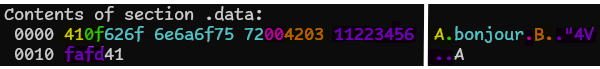
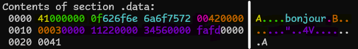

Killian FRABOUL  
Luc HERNANDEZ  
INM-S4-01
# TP3
## 3.1) Déclaration de données en langage d'assemblage
Après avoir effectué les commandes fournies par le TP, on constate que les informations affichées par la commande `arm-eabi-objdump -j .data -s donnees.o` sont en hexadecimal avec 4 blocs de 4  octets par ligne ( soit 16 octets ).  
On peut le constater avec les adresses qui sont écrites sur la gauche 0010 étant l'adresse


*Ici les couleurs à gauche et à droite correspondent entre elles*

Sur la première ligne, on obtient : `410f626f 6e6a6f75 72004203 11223456`, ce qui correspond à :  
`entier 65 -> 41`, `entier 15 -> 0f`  
`Les caractères de "bonjour" -> 62 6f 6e 6a 6f 75 72`  
`Le signal de fin de string -> 00`  
`Le couple entier 66 (<=> caractère B) - entier 3 -> 42 03`  
`Tableau d'entiers de 16 bits -> 1122 3456`  
On est ensuite forcé de changer de ligne etant donné qu'on a utilisé nos 16 octets.  
Sur la deuxième ligne on a donc la suite du tableau :  
`fafd` puis `Entier 65 -> 41`.  
On constate que les chaînes de caractères sont simplement des suites d'entiers qui se finissent par 00 pour indiquer une fin de chaîne.

Après avoir créé le fichier donnees2.s en remplaçant les entiers par des entiers 32 bits, je constate bien que j'ai 4 octets de réservés pour l'entier, soit 32 bits.

On a donc:
```asm
@ Tous les .word sont des entiers 32 bits
    .data
aa: .byte 65    @ .byte 0x41 est un char donc on ne change pas
oo: .word 15   @ .byte  0x0f On a ici un entier code sur 32 bits
cc: .asciz "bonjour"
rr: .byte 66   @ .byte 0x42 est un char donc on ne change pas
    .word 3
T: .word 0x1122
   .word 0x3456
   .word  0xfafd
xx: .word 65
```

*Encore une fois, on a correspondance entre les couleurs*


## 3.2) Accès à la mémoire : échange mémoire / registres
### 3.2.1) Lecture d'un mot de 32 bits
Les deux valeurs affichées par accesmem sont l'adresse de xx et la valeur de xx.  

0001f440 <=> 128064 <=> Une adresse mémoire  
0000010a <=> 266 <=> xx  

`LDR r5, LD_xx` met l'adresse de xx dans r5  
`LDR r6, [r5]` met la valeur à l'adresse contenue par r5 dans r6  

### 3.2.2) Lecture de mots de tailles différentes
Pour afficher les adresses et leurs valeurs, nous avons utilisé les fonctions qui étaient déjà fournies à la suite du programme.  
```assembly
      MOV r1, r3
      BL EcrNdecimal32
      MOV r1, r4
      BL EcrNdecimal32 @ Car D1 fait 32b
      MOV r1, r5
      BL EcrNdecimal32
      MOV r1, r6
      BL EcrNdecimal16 @ Car D2 fait 16b
      MOV r1, r7
      BL EcrNdecimal32
      MOV r1, r8
      BL EcrNdecimal8  @ Car D3 fait 8b
```
On constate bien que les différentes valeurs données dans le fichier donnees2.s sont affichées ainsi que leurs adresses.  
L'écart d'octets entre D1 et D2 (4o) est plus grand que celui entre D2 et D3 (2o) car D1 fait 4o et donc prend plus de place que D2 (2o). Si on rajoutait un D4 il serait 1 octet plus loin dans la mémoire car D3 fait 1o.  

### 3.2.3) Ecriture en mémoire
Pour faire 3 fois la même opération, il a suffit de changer la référence qu'on utitlisait ainsi que les fonctions utilisées pour afficher les chiffres.

```
00000000
0
fffffff6
-10
0000
0
fff6
-10
00
0
f6
-10
```
On compile évidemment le programme en prenant en compte es.o, car on utilise les fonctions qui y sont stockées.  
Ici on voit bien que la valeur commence par être 0 puis qu'elle est changée en -10.  
On voit ici aussi comment le complément à deux fonctionne. On voit bien que le bit de poids fort est répété sur la gauche.  

## 3.3)
Pour afficher le au revoir, nous avons bel et bien utilisé la méthode de l'indirection avec un pointeur relais.
Pour ce faire, il nous a suffit de stocker l'adresse de l'asciz dans un word pour ensuite load cette adresse dans r1 puis écrire le mot qui se trouver dans le registre 1 avec EcrChaine.
On a donc :
```
    .data
cc: @ ne pas modifier cette partie
    .byte 0x42
    .byte 0x4f
    .byte 0x4e
    .byte 0x4a
    .byte 0x4f
    .byte 0x55
    .byte 0x52
    .byte 0x00     @ code de fin de chaine
    @ la suite pourra etr emofifiee
    .word 12
    .word 0x11223344


rv: .asciz "au revoir..."

    .text
    .global main
main:

@ impression de la chaine de caractere d'adresse cc
     ldr r1, LD_cc
     bl EcrChaine

@ impression de la chaine "au revoir..."
    ldr r1, LD_rv
    bl EcrChaine

@ modification de la chaine d'adresse cc
@ A COMPLETER

@ impression de la chaine cc modifiee
     ldr r1, LD_cc
     bl EcrChaine

fin: B exit  @ terminaison immédiate du processus (plus tard on saura faire mieux)

LD_cc: .word cc
LD_rv: .word rv
```

Pour ce qui est du passage de "BONJOUR" à "bonjour", nous avons décidé de faire le ORR caractères par caractère, pour ensuite l'afficher sans soucis, et donc sans boucles. Nous avons donc a chaque fois modifié la valeur enregistrée dans le registre r2 pour aller au caractère suivant après à chaques fois.
```
LDRB r3, [r2]
ORR r3, r3, #32
STRB r3, [r2]
ADD r2, r2, #1
```
Ce bloc de code a été répété plusieurs fois pour pouvoir faire tout les caractères composant le mot BONJOUR.
On obtient comme résultat final:
```
BONJOUR
au revoir...
bonjour
```

## 3.4) Alignements et "petits bouts"
On constate en lançant notre programme alignements que le chiffre codé sur 32 bits ne correspond pas à la valeur affichée par le programme:
```
01
02
04
0402010d
08
```
Comme prévu; le .balign permet q l'entier d'être placé à une adresse multiple de 4 et il s'affiche maintenant correctement:
```
01
02
04
0a0b0c0d
08
```

Pour ce qui est de la reproduction de l'expérience, on constate bien que, si on déclare un hword juste après b, on a un problème:
```
...
b: .byte 0x08
c: .hword 0xABCD
...
@impression du mot c
        LDR r2, LD_c
        LDRH r3, [r2]
        MOV r1, r3
        BL EcrHexa16
...
LD_c: .word c
```

```
01
02
04
0a0b0c0d
08
cd08
```
Alors que si on ajoute un .balign 2, on n'a plus le problème
```
01
02
04
0a0b0c0d
08
abcd
```

### 3.4.2) Question de "Petits bouts"
Pour ce passage, on peut retrouver les 3 chiffres définis sur la ligne 1f438, où on peut les trouver écrits octets par octets (lus de droite a gauche étant donné que nous sommes en little endian):
```
18000000 0a010000 2a000000
```
Respectivement 24 266 42  

On peut faire de même avec accesmem2, où on trouve les chiffres sur la ligne 1f470, même si il faire attention au fait qu'il ne sont pqs tous en 32 bits.
```
0a010000 2a000c00
```
Respectivement 266 42 12.