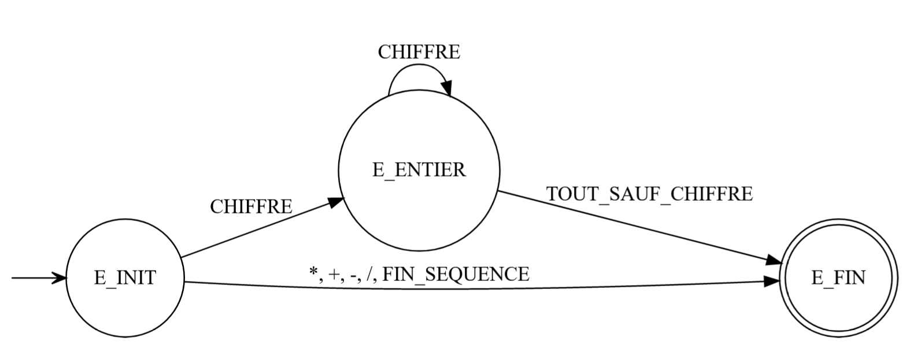

Luc Hernandez - Killian Fraboul

# Exercice 1
entree1.txt contient une expression arithmétique correcte. (On a bel et bien une alternance entre entiers et opérateurs commençant et se finissant par des entiers)  

voir Fichiers_C/entree2.txt

# Exercice 2

Pour ce faire, nous avons simplement rajouté la division à l'enum Nature_Lexeme puis rajouté le cas où on lit un symbole qui correspond à '/' pour passer `lexeme_en_cours.nature` à division. Nous avons ensuite fait un `grep -n -E 'MUL|PLUS|MOINS' *` pour savoir où le type Nature_Lexeme est utilisé et nous avons patché ces différents endroits pour qu'il fonctionnent aussi avec DIVISION.  

# Exercice 3
Pour cet exercice, nous avons décidé d'inclure l'analyse lexicale (sans interface) à la fonction analyse car il est tout simplement insensé de faire une analyse syntaxique sur une expression qui ne parle même pas le même langage que celui que l'on s'est fixé.  

# Extension
## Nombres à virgules
Pour cette partie, il nous a suffit de réfléchir à une façon de démarquer la partie après la virgule de celle avant la virgule. C'est pourquoi nous avons créé `virgule_state` qui nous permet de faire le calcul rammenant ce qui est censé être après la virgule après la virgule. (on divise le résultat par 10 puissance le nombre de chiffres après la virgule).